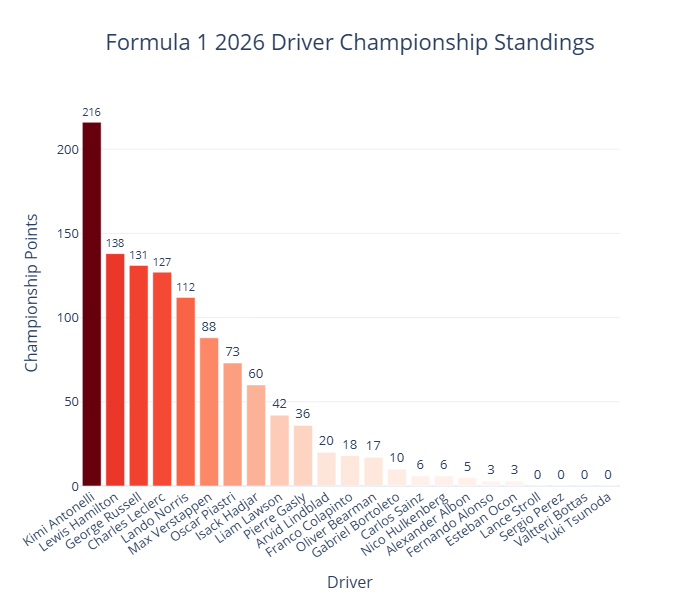
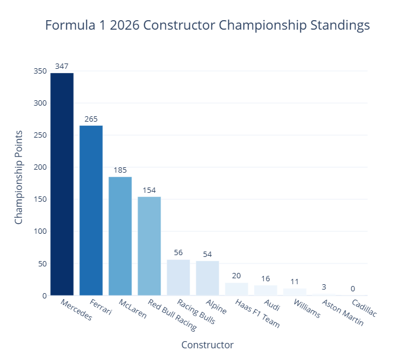
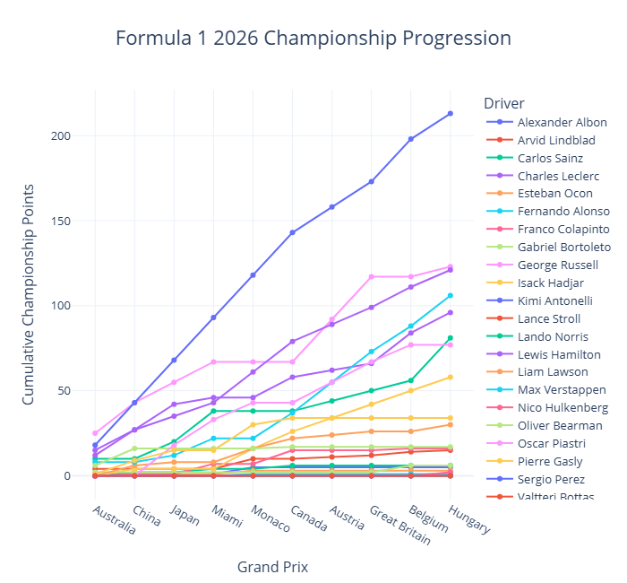

# 🏎️ Formula 1 World Drivers Championship 2026

<p align="center">


</p>

---

## 📌 Project Overview

This project presents an **end-to-end Formula 1 data analytics and machine learning project** focused on the **2026 Formula 1 World Drivers' Championship (WDC)**.

The project covers the complete data workflow, starting from Formula 1 race data collection, data cleaning, exploratory data analysis, feature engineering, interactive dashboard visualization, and World Drivers' Championship prediction.

The main objective is to analyze driver and constructor performance throughout the 2026 Formula 1 season and use historical race-performance features to estimate the potential outcome of the **2026 World Drivers' Championship**.

---

## 🎯 Project Objectives

The main objectives of this project are:

- Collect Formula 1 race-result data for the 2026 season.
- Clean and validate the collected race data.
- Explore driver and constructor performance.
- Analyze championship progression throughout the season.
- Create driver-level performance features.
- Develop an interactive Formula 1 dashboard.
- Estimate potential 2026 WDC championship outcomes.
- Present analytical results in a portfolio-ready format.

---

# 🔄 Project Workflow

The project follows an end-to-end data analytics workflow:

```text
01. Data Collection
        ↓
02. Collect All Race Results
        ↓
03. Data Cleaning
        ↓
04. Exploratory Data Analysis
        ↓
05. Feature Engineering
        ↓
06. Dashboard
        ↓
07. WDC Prediction
```

Each stage is implemented in a separate Jupyter Notebook.

---

# 📓 Notebook Pipeline

## 01 — Data Collection

Collects Formula 1 race data using the **FastF1** Python library.

```text
notebook/01_data_collection.ipynb
```

The collected data is used as the initial source for the project.

---

## 02 — Collect All Race Results

Collects and combines the available 2026 Grand Prix race results into a single raw dataset.

```text
notebook/02_collect_all_races.ipynb
```

Output:

```text
data/raw/wdc_2026_results.csv
```

---

## 03 — Data Cleaning

Cleans and validates the collected Formula 1 race-result data.

The cleaning stage includes:

- Handling dataset consistency
- Checking duplicate records
- Validating race information
- Checking missing values
- Preparing the dataset for analysis

```text
notebook/03_data_cleaning.ipynb
```

Output:

```text
data/processed/wdc_clean.csv
```

---

## 04 — Exploratory Data Analysis

Performs exploratory analysis to understand driver and constructor performance throughout the season.

```text
notebook/04_exploration_data_analysis.ipynb
```

The analysis includes:

- Driver championship standings
- Constructor standings
- Championship progression
- Race wins
- Podium finishes
- Average finishing position
- Driver performance patterns

---

## 05 — Feature Engineering

Creates aggregated driver-level performance features that are used in the prediction stage.

```text
notebook/05_feature_engineering.ipynb
```

Output:

```text
data/processed/driver_features.csv
```

The engineered features include:

- Total Races
- Total Points
- Wins
- Podiums
- Average Finish
- Average Grid
- Win Rate
- Podium Rate
- Points per Race
- Best Finish
- Worst Finish
- Average Position Gain
- DNF Rate

---

## 06 — Dashboard

Creates the interactive Formula 1 dashboard using **Streamlit** and **Plotly**.

```text
notebook/06_dashboard.ipynb
```

The dashboard visualizes:

- Driver Championship Standings
- Constructor Championship Standings
- Championship Progression
- Race Wins
- Podium Finishes
- Average Finish Position

---

## 07 — WDC Prediction

Uses the engineered driver-level features to estimate the potential outcome of the **2026 World Drivers' Championship**.

```text
notebook/07_prediction.ipynb
```

The prediction analysis includes:

- Predicted championship points
- Relative probability
- Predicted WDC ranking
- Top 5 predicted drivers
- Driver-level prediction analysis
- Predicted WDC Champion

Prediction output:

```text
data/processed/wdc_2026_prediction.csv
```

---

# 🤖 WDC Championship Prediction

The prediction stage estimates the potential championship outcome based on driver performance features derived from the collected race data.

### 🏆 Current Prediction Result

Based on the current prediction output:

**Predicted WDC Champion: Kimi Antonelli**

| Metric | Result |
|---|---:|
| Predicted Points | 155.29 |
| Relative Probability | 14.15% |

### 🏁 Predicted Top 5

The prediction notebook also generates a **Top 5 predicted drivers** based on the calculated predicted championship points and relative probability.

> ⚠️ **Disclaimer:** The prediction is a model-based analytical estimate created for portfolio and educational purposes. It does not represent an official Formula 1 or FIA championship result.

---

# 📸 Dashboard Preview

### 🏆 Driver Championship Standings



### 🏎️ Constructor Championship Standings



### 📈 Championship Progression



---

# ✨ Dashboard Features

The interactive dashboard provides several analytical features:

- 🏆 Driver Championship Standings
- 🏎️ Constructor Championship Standings
- 📈 Championship Progression
- 🥇 Race Wins Analysis
- 🥈 Podium Finishes Analysis
- 📊 Average Finish Position
- 📥 Dataset Download
- 🔍 Team Filtering
- 👤 Driver Filtering
- 📋 Dataset Preview
- 🌙 Dark Mode Dashboard

---

# 📊 Dashboard Visualizations

## 🏆 Driver Championship Standings

Shows the total championship points earned by each Formula 1 driver.

This visualization allows users to compare driver performance and identify the leading drivers in the championship.

---

## 🏎️ Constructor Championship Standings

Displays the total championship points accumulated by each constructor.

This provides an overview of team performance throughout the season.

---

## 📈 Championship Progression

Illustrates the cumulative championship points after each Grand Prix.

This visualization helps identify how the championship battle changes throughout the season.

---

## 🥇 Race Wins

Compares the number of race victories achieved by each driver.

---

## 🥈 Podium Finishes

Shows the number of podium finishes achieved by each driver.

---

## 📊 Average Finish Position

Displays the average finishing position of each driver across the races included in the dataset.

A lower average finishing position indicates stronger overall race performance.

---

# 📁 Dataset

The project uses several datasets throughout the data analytics pipeline.

## Raw Dataset

```text
data/raw/wdc_2026_results.csv
```

Contains the collected Formula 1 race-result data used as the initial dataset.

---

## Clean Dataset

```text
data/processed/wdc_clean.csv
```

Contains the cleaned and validated Formula 1 race-result data used for analysis.

---

## Driver Features Dataset

```text
data/processed/driver_features.csv
```

Contains aggregated driver-level performance features used as inputs for the prediction stage.

The dataset contains features such as:

- Driver Name
- Team
- Total Races
- Total Points
- Wins
- Podiums
- Average Finish
- Average Grid
- Win Rate
- Podium Rate
- Points per Race
- Best Finish
- Worst Finish
- Average Position Gain
- DNF Rate

---

## Prediction Dataset

```text
data/processed/wdc_2026_prediction.csv
```

Contains the prediction results generated by the WDC prediction notebook.

The prediction dataset includes information used to evaluate the potential championship outcome, including:

- Driver
- Predicted Points
- Relative Probability
- Predicted Ranking
- Championship Prediction

---

# 📂 Project Structure

```text
Analisis F1 WDC 2026/
│
├── dashboard/
│   ├── average_finish.html
│   ├── championship_progression.html
│   ├── constructor_standings.html
│   ├── driver_standings.html
│   ├── podium_count.html
│   └── wins_by_driver.html
│
├── data/
│   ├── raw/
│   │   └── wdc_2026_results.csv
│   │
│   └── processed/
│       ├── wdc_clean.csv
│       ├── driver_features.csv
│       └── wdc_2026_prediction.csv
│
├── images/
│   ├── average_finish.png
│   ├── championship_progression.png
│   ├── constructor_standings.png
│   ├── driver_standings.png
│   ├── podium_count.png
│   └── wins_by_driver.png
│
├── notebook/
│   ├── 01_data_collection.ipynb
│   ├── 02_collect_all_races.ipynb
│   ├── 03_data_cleaning.ipynb
│   ├── 04_exploration_data_analysis.ipynb
│   ├── 05_feature_engineering.ipynb
│   ├── 06_dashboard.ipynb
│   └── 07_prediction.ipynb
│
├── reports/
│
├── app.py
├── requirements.txt
└── README.md
```

---

# 🛠️ Technologies Used

### Programming Language

- Python 3.12

### Data Collection

- FastF1

### Data Analysis

- Pandas
- NumPy

### Data Visualization

- Matplotlib
- Plotly
- Plotly Express

### Machine Learning

- Scikit-Learn

### Dashboard

- Streamlit

### File Processing

- OpenPyXL

### Development Environment

- Jupyter Notebook
- Google Colab

---

# 🚀 Installation

## 1. Clone the Repository

```bash
git clone https://github.com/reginasnp/F1-WDC-2026.git
```

## 2. Navigate to the Project Directory

```bash
cd F1-WDC-2026
```

## 3. Install Dependencies

```bash
pip install -r requirements.txt
```

## 4. Run the Streamlit Dashboard

```bash
streamlit run app.py
```

The dashboard will then be available through the local Streamlit server.

---

# 📊 Data Analysis Approach

The project follows a structured data analytics approach:

### 1. Data Collection

Formula 1 race data is collected using the FastF1 library.

### 2. Data Preparation

The collected data is combined and stored as the raw dataset.

### 3. Data Cleaning

The raw dataset is cleaned and validated to ensure consistency before analysis.

### 4. Exploratory Data Analysis

Driver and constructor performance are analyzed using statistical summaries and visualizations.

### 5. Feature Engineering

Driver-level performance metrics are aggregated into a structured feature dataset.

### 6. Dashboard Development

The analytical results are presented through an interactive Streamlit dashboard.

### 7. Prediction

Driver performance features are used to estimate potential 2026 WDC championship outcomes.

---

# 📌 Key Analytical Outputs

The project produces several key analytical outputs:

- Driver Championship Standings
- Constructor Championship Standings
- Championship Progression
- Driver Race Wins
- Driver Podium Counts
- Average Driver Finish
- Driver Performance Features
- WDC Prediction Ranking
- Predicted WDC Champion
- Predicted Championship Points
- Relative Championship Probability

---

# ⚠️ Limitations

Several limitations should be considered when interpreting the results:

- The prediction is based on the available race data included in the dataset.
- Driver performance can change significantly between races.
- Future race results cannot be known with certainty.
- The prediction should be interpreted as an analytical estimate rather than an official championship result.
- Race incidents, strategy, weather, mechanical failures, penalties, and other external factors may affect actual results.

---

# 📌 Future Improvements

Potential improvements for future versions include:

- Driver Comparison Dashboard
- Constructor Performance Analysis
- Qualifying Analysis
- Lap Time Analysis
- Pit Stop Analysis
- Race Pace Analysis
- Sprint Race Analysis
- Additional driver performance features
- Comparison of multiple machine learning algorithms
- Improved model validation
- Hyperparameter optimization
- Model explainability
- Automatic data updates after each Grand Prix
- Automated prediction updates
- Streamlit Community Cloud deployment

---

# 👩‍💻 Author

**Regina Syahda Nabia Putri**

GitHub:

https://github.com/reginasnp

---

⭐ If you find this project interesting, consider giving the repository a star!